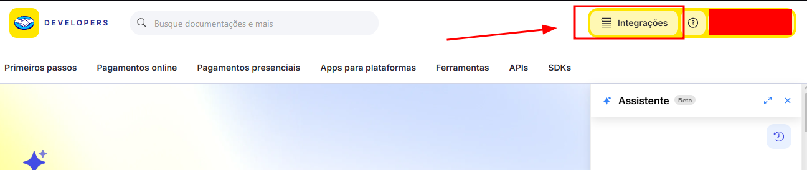
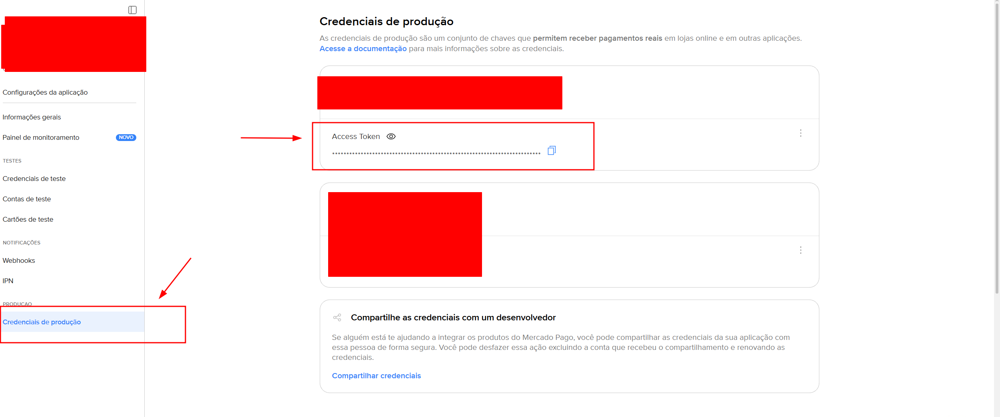
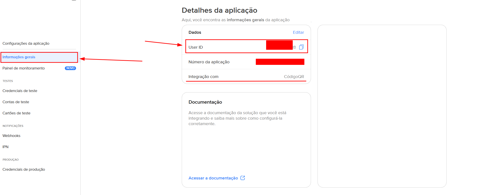

# API de Pagamentos — Mercado Pago

Projeto desenvolvido em Python para integração com a API do Mercado Pago, com foco em pagamentos presenciais por QR Code.

## Sobre o projeto

O projeto reúne scripts para facilitar a integração com recursos do Mercado Pago, incluindo:

* Configuração de credenciais;
* Criação de lojas (Stores);
* Criação de pontos de venda (POS);
* Criação de pedidos (Orders);
* Geração de QR Code para pagamento;
* Consulta e verificação do status dos pagamentos.

## Estrutura do projeto

```text
Projeto API pagamento/
├── API/
├── Criar_LojaML/
├── Pago/
├── Scripts_ML/
├── Verificadores/
├── conectar_token.py
├── criar.loja.py
├── main.py
├── requirements.txt
├── .gitignore
└── README.md
```

> A estrutura pode mudar conforme novas funcionalidades forem adicionadas.

## Requisitos

* Python 3;
* Conta Mercado Pago;
* Credenciais de integração do Mercado Pago;
* Ambiente virtual Python (`venv`) recomendado.

## Instalação

Clone o repositório e entre na pasta do projeto.

Crie o ambiente virtual:

```bash
python -m venv venv
```

Ative o ambiente virtual no Windows:

```bash
venv\Scripts\activate
```

Instale as dependências:

```bash
pip install -r requirements.txt
```

## Tutorial

### 1. Criando a integração

Acesse o portal de desenvolvedores do Mercado Pago:

https://www.mercadopago.com.br/developers/pt


Configure para integração com Qrcode

### 2. Configurando as credenciais

Configure as credenciais utilizadas pelo projeto.



> **Importante:** nunca publique seu Access Token, Client Secret ou outras credenciais no GitHub.



Após configurar as credenciais, confira se os valores utilizados pelo projeto estão corretos antes de executar os scripts.

### 3. Criando a loja

Execute o arquivo responsável pela criação da loja:

```bash
python criar.loja.py
```

O processo utilizará as credenciais configuradas anteriormente para criar a loja no Mercado Pago.

### 4. Gerando o QR Code

Execute o arquivo principal:

```bash
python main.py
```

O sistema realizará o fluxo necessário para gerar o QR Code e iniciar o processo de pagamento.

## Fluxo da integração

```text
Credenciais
    ↓
Criação da loja
    ↓
Criação do POS
    ↓
Criação do Order
    ↓
Geração do QR Code
    ↓
Pagamento
    ↓
Consulta do Order
    ↓
Verificação do pagamento
```

## Documentação utilizada

### Mercado Pago

**Criar loja**

https://www.mercadopago.com.br/developers/pt/reference/in-person-payments/qr-code/stores/create-store/post

**Criar POS**

https://www.mercadopago.com.br/developers/pt/reference/in-person-payments/point/pos/create-pos/post

**Criar Order**

https://www.mercadopago.com.br/developers/pt/reference/in-person-payments/qr-code/orders/create-order/post

**Consultar Order**

https://www.mercadopago.com.br/developers/pt/reference/in-person-payments/point/pos/create-pos/post

**Credenciais do Mercado Pago**

https://www.mercadopago.com.br/developers/pt/docs/your-integrations/credentials

### Python

**Módulo `time` — acesso e conversões de tempo**

https://docs.python.org/pt-br/3/library/time.html

**Módulo `datetime` — tipos básicos de data e hora**

https://docs.python.org/3/library/datetime.html

## Segurança

Nunca publique no repositório:

* Access Token;
* Client Secret;

## Observação

Este projeto foi desenvolvido com base na documentação oficial do Mercado Pago e da linguagem Python.

Os endpoints e comportamentos da API podem sofrer alterações. Por isso, recomenda-se consultar a documentação oficial antes de realizar novas integrações ou alterações no código.

## Autor

Projeto desenvolvido por **Osvaldeir** para estudo e prática de integração com APIs utilizando Python.
